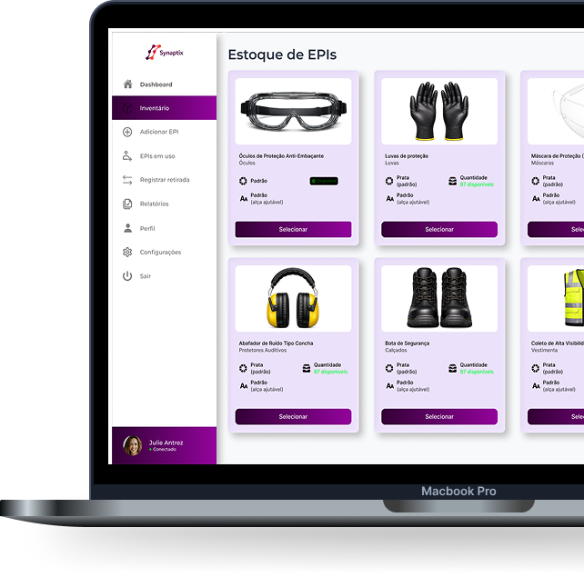

# 🎯 Synaptix - Plataforma de Gestão de Inventário

<div align="center">



**Solução inteligente para controle, rastreabilidade e otimização de inventário empresarial**

[](https://vuejs.org/)
[](https://vitejs.dev/)
[](https://router.vuejs.org/)
[](https://supabase.com/)
[](https://www.npmjs.com/package/primeicons)

</div>

## 🚀 Visão Geral

O **Synaptix** é uma plataforma front-end construída com Vue 3 para facilitador a gestão e controle de inventário em empresas.

A aplicação oferece:

- Autenticação segura com Supabase
- Navegação protegida para área interna
- Dashboard completo com menu lateral
- Páginas para cadastro, entregas, retiradas e relatórios
- Interface responsiva para desktop, tablet e mobile
- Carrossel infinito de features e funcionalidades

## ✨ Funcionalidades Principais

### 🔐 Autenticação e Acesso

- [x] Login com e-mail e senha
- [x] Logout com redirecionamento
- [x] Guard de rotas privadas no Vue Router
- [x] Integração com Supabase Auth
- [x] Recuperação de sessão

### 📊 Dashboard

- [x] Rota pai com subrotas (`/dashboard/...`)
- [x] SideBar com navegação interna
- [x] Módulos de:
  - Inventário
  - Entregas
  - Retiradas
  - Relatório

### 🎨 Interface

- [x] Home institucional com seções informativas
- [x] Carrossel infinito de features
- [x] Cards com cores personalizadas
- [x] Layout responsivo adaptado para mobile e tablet
- [x] Header dinâmica e intuitiva
- [x] Footer informativo

### 📈 Gestão

- [x] Adição de itens ao inventário
- [x] Rastreamento de entregas
- [x] Controle de retiradas
- [x] Relatórios detalhados

## 🧱 Stack do Projeto

```text
⚡ Vite            - Build tool e servidor de desenvolvimento
🟢 Vue 3           - Framework principal de interface
🧭 Vue Router      - Roteamento SPA com children routes
🧩 Supabase JS     - Autenticação e acesso ao backend
🎯 PrimeIcons      - Biblioteca de ícones
📦 Composables     - Lógica reutilizável com Vue Composition API
```

## 📁 Estrutura de Pastas

```text
Synaptix/
├── components/
│   ├── AppHeader.vue
│   ├── AppFooter.vue
│   ├── Sidebar.vue
│   └── Cards.vue
├── public/
│   └── Images/
│       ├── logo.png
│       ├── homeImg.png
│       ├── dashboard1.png
│       └── homeFone.png
├── src/
│   ├── assets/
│   ├── composables/
│   │   └── useSupabase.js
│   ├── database/
│   │   └── schema.sql
│   ├── router/
│   │   └── index.js
│   ├── views/
│   │   ├── Home.vue
│   │   ├── Login.vue
│   │   ├── Dashboard.vue
│   │   ├── Inventario.vue
│   │   ├── EmUso.vue
│   │   ├── Adicionar.vue
│   │   ├── Retirada.vue
│   │   └── Relatorio.vue
│   ├── App.vue
│   ├── main.js
│   └── style.css
├── index.html
├── package.json
├── vite.config.js
└── README.md
```

## ⚙️ Configuração de Ambiente

Crie um arquivo `.env` na raiz do projeto com as variáveis do Supabase:

```env
VITE_SUPABASE_URL=https://SEU-PROJETO.supabase.co
VITE_SUPABASE_ANON_KEY=SUA_CHAVE_ANON
```

## 🧪 Como Executar

### 1. Instalar dependências

```bash
npm install
```

### 2. Rodar em desenvolvimento

```bash
npm run dev
```

O servidor estará disponível em `http://localhost:5173`

### 3. Gerar build

```bash
npm run build
```

### 4. Visualizar build

```bash
npm run preview
```

## 🔗 Rotas Principais

| Rota                  | Tipo    | Descrição                        |
| --------------------- | ------- | -------------------------------- |
| `/`                   | Pública | Página inicial                   |
| `/login`              | Pública | Autenticação de usuário          |
| `/dashboard`          | Privada | Container principal do painel    |
| `/dashboard/inventario` | Privada | Módulo de inventário             |
| `/dashboard/em-uso`   | Privada | Itens em uso                     |
| `/dashboard/adicionar` | Privada | Adicionar novo item              |
| `/dashboard/retirada` | Privada | Módulo de retiradas              |
| `/dashboard/relatorio` | Privada | Módulo de relatórios             |

## 🛠️ Schema do Banco de Dados

O arquivo `src/database/schema.sql` contém a estrutura inicial do banco de dados com tabelas para:

- Usuários e autenticação
- Itens de inventário
- Histórico de movimentação
- Relatórios

## 🎨 Customização

### Cores Personalizadas

O projeto utiliza um sistema de cores modular:

- **Primária**: `#FF5E35` (Laranja)
- **Secundária**: `#FF4235` (Vermelho)
- **Destaque**: `#FF8635` (Laranja claro)
- **Coral**: `#FF6135`

### Responsividade

Breakpoints utilizados:

- Desktop: `1024px+`
- Tablet: `768px - 1024px`
- Mobile: `480px - 768px`
- Extra small: `375px - 480px`

## 🤝 Contribuição

Para contribuir:

1. Crie uma branch para sua feature
2. Faça commits pequenos e descritivos
3. Teste suas mudanças
4. Abra um Pull Request com o contexto da mudança

## 📝 Convenções de Código

- **Componentes**: Use `<script setup>` do Vue 3
- **Estilos**: CSS scoped em cada componente
- **Roteamento**: Lazy loading para rotas não críticas
- **Composables**: Para lógica reutilizável entre componentes

## 🐛 Troubleshooting

### Problema: Porta 5173 já está em uso

```bash
npm run dev -- --port 3000
```

### Problema: Erro de autenticação Supabase

Verifique se as variáveis `.env` estão configuradas corretamente e se o projeto Supabase está ativo.

### Problema: Imagens não carregam

Certifique-se de que os arquivos estão no diretório `public/Images/` e use caminhos relativos corretos.

## 📄 Licença

Este projeto está em desenvolvimento. Todos os direitos reservados.

---

<div align="center">

**Synaptix - Gestão inteligente de inventário em nuvem**

Desenvolvido com ❤️ usando Vue 3 e Vite

</div>
